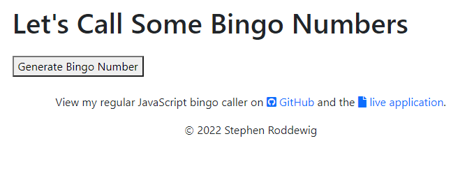
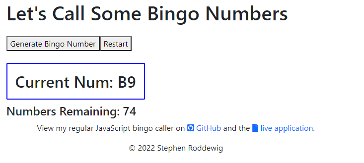
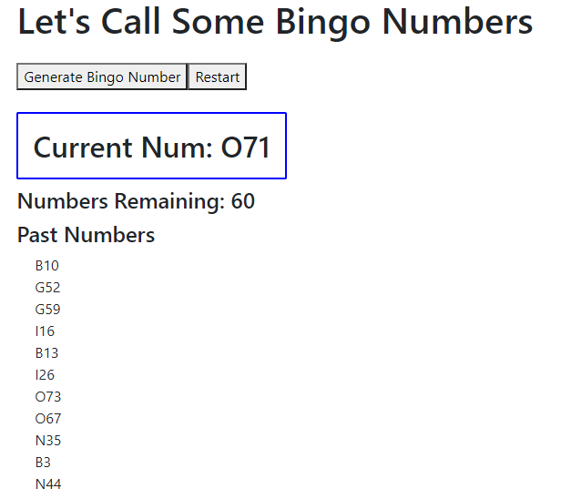

# React Bingo Caller App

## Table of Contents
- [Project Overview](#project-overview)
- [Live Application](#live-application)
- [Installation](#installation)
- [License](#license)
- [Screenshots](#screenshots)

## Project Overview
This bingo number calling app is built for use with the [My Free Bingo Cards website](https://myfreebingocards.com/). It is intended to solve a shortcoming with the website when it comes to the number calling, which is relegated to three preset call sequences. In this case, if participants kept their original cards, you would only be able to play three rounds of bingo. Otherwise, you would already know the winner of whichever call sequence you selected on Round 4.

In light of this issue, I said "How hard can it be to write a random bingo number caller?" This application and the [regular JS implementation](https://github.com/Captain63/bingo-caller) that preceded it are the result of that question.

[View the live application](https://captain63.github.io/react-bingo-caller).

### Languages Used
- JavaScript (React)
- HTML
- CSS (Bootstrap)

### Node Libraries Used
- [React](https://www.npmjs.com/package/react)
- [Bootstrap](https://www.npmjs.com/package/bootstrap)
- [GH-Pages](https://www.npmjs.com/package/gh-pages)

See [package.json](./package.json) for full list of dependencies.

### Additional Libraries
- [Font Awesome](https://fontawesome.com)

## Live Application
[View deployed application](https://captain63.github.io/react-bingo-caller).

## Installation
To run this application on your local machine, Node.js is _required_. Once cloned/downloaded from GitHub, enter ```npm i``` in command line to install the packages referenced under Libraries Used automatically. 
You are now be ready to launch the application by entering ```npm start```.

## License
Permission is hereby granted, free of charge, to any person obtaining a copy of this Software and associated documentation files (the "Software"), to deal in the Software without  restriction, including without limitation the rights to use, copy, modify, merge, publish distribute, sublicense, and/or sell copies of the Software, and to permit persons to whom the Software is furnished to do so, subject to the following conditions.

[View the full license](./LICENSE)

## Screenshots
### Initial view


### First number called


### Past numbers populated
